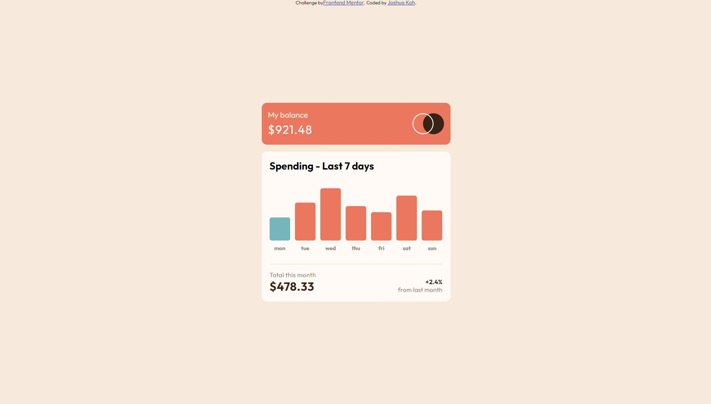
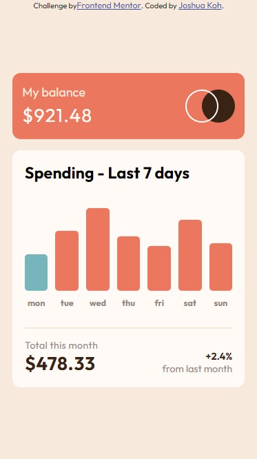

# Frontend Mentor - Expenses chart component solution

This is a solution to the [Expenses chart component challenge on Frontend Mentor](https://www.frontendmentor.io/challenges/expenses-chart-component-e7yJBUdjwt). Frontend Mentor challenges help you improve your coding skills by building realistic projects.

## Table of contents

- [Overview](#overview)
  - [The challenge](#the-challenge)
  - [Screenshot](#screenshot)
  - [Links](#links)
- [My process](#my-process)
  - [Built with](#built-with)
- [Author](#author)

## Overview

This is a challenge from Frontend Mentor to build a expenses chart component which responsive in both desktop and mobile view. I'm using React.js to solve this challenge.

### The challenge

Users should be able to:

- View the bar chart and hover over the individual bars to see the correct amounts for each day
- See the current day’s bar highlighted in a different colour to the other bars
- View the optimal layout for the content depending on their device’s screen size
- See hover states for all interactive elements on the page
- **Bonus**: Use the JSON data file provided to dynamically size the bars on the chart

### Screenshot

### Links

- Solution URL: [https://www.frontendmentor.io/solutions/responsive-dynamic-expenses-chart-component-reactjs-RPI-eXUf_4](https://www.frontendmentor.io/solutions/responsive-dynamic-expenses-chart-component-reactjs-RPI-eXUf_4)
- Live Site URL: [https://fm-expenses-chart-component-main.vercel.app](https://fm-expenses-chart-component-main.vercel.app)

## My process

I took around one and half day to complete this challenge. The most challenging part is to visualize the data into bar chart which took me most of the time there.

### Built with

- Semantic HTML5 markup
- CSS custom properties
- Flexbox
- [React](https://reactjs.org/) - JS library

## Author

- Website - [Joshua Koh](https://github.com/Joshuakme)
- Frontend Mentor - [@Joshuakme](https://www.frontendmentor.io/profile/Joshuakme)
